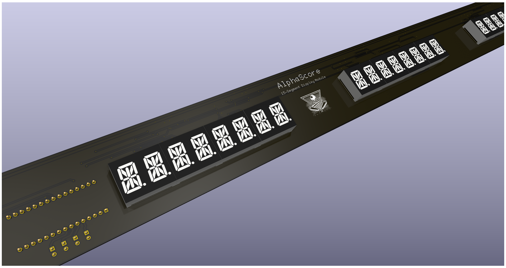

<p align="center">
  <h1 align="center">AlphaScore Display Controller</h1>

  <p align="center">
    Arduino Nano based controller for driving up to four 8-character alphanumeric displays.
  </p>
</p>

<p align="center">
  
</p>

---

## Overview

AlphaScore is an Arduino Nano based display controller designed to drive up to four 8-character alphanumeric displays.

The firmware was originally developed as a replacement display controller for classic pinball machines and is fully compatible with the **myPinballs Compatibility Protocol**.

In addition to compatibility mode, AlphaScore introduces an extended protocol providing direct segment control, brightness adjustment, display management and additional advanced features.

The controller communicates over a UART serial interface and does not require any acknowledgements or responses from the host.

---

## Features

* Supports up to 4 independent alphanumeric displays
* 8 characters per display
* UART communication (115200 baud)
* Compatible with the myPinballs Compatibility Protocol
* Extended AlphaScore Protocol
* Direct 7-segment and 15-segment control
* Individual or global brightness control
* Demo Mode
* Automatic thousands separator formatting for numeric values

---

## Communication

| Parameter              | Value                    |
| ---------------------- | ------------------------ |
| Interface              | UART                     |
| Baud rate              | **115200**               |
| Line ending            | LF (`\n`)                |
| CR (`\r`)              | Ignored (CRLF supported) |
| Maximum command length | 95 characters            |

The controller does **not** transmit acknowledgements or responses.

---

## Display Configuration

| Parameter              | Value |
| ---------------------- | ----- |
| Displays               | 1-4   |
| Characters per display | 8     |

---

# myPinballs Compatibility Protocol

Command format:

```text
MODE:DISPLAY:TEXT
```

Example:

```text
1:2:12345678
```

## Supported Modes

| Mode  | Function                  |
| ----- | ------------------------- |
| **1** | Static text               |
| **2** | Flash entire display      |
| **3** | Clear display             |
| **4** | Flash last two characters |

Examples:

```text
1:2:PLAYER 1
2:3:JACKPOT
3:1:
4:4:MATCH  25
```

### Text Processing

* Maximum text length is 8 characters.
* Longer strings are truncated.
* Shorter strings are padded with spaces.

If the text consists only of:

* digits
* spaces
* `?`

the controller automatically inserts thousands separators before displaying the value.

Example:

```text
1:1:12345678
```

---

# AlphaScore Protocol

All extended commands begin with:

```text
@
```

<details>

<summary><strong>Raw Segment Control</strong></summary>

Directly controls display segments by sending raw segment masks.

Format:

```text
@R:DISPLAY:MASK1,MASK2,...,MASK8
```

### 7-segment example

```text
@R:1:3F,06,5B,4F,66,6D,7D,07
```

### 15-segment example

```text
@R:2:0001,0002,0004,0008,0010,0020,00C0,4000
```

#### Rules

* 1-2 hexadecimal digits → 7-segment mask
* 3-4 hexadecimal digits → native 15-segment mask
* Uppercase and lowercase hexadecimal digits are accepted
* Missing masks are treated as `0000`
* Maximum of 8 masks is processed

> **Important**
>
> To force a value to be interpreted as a 15-segment mask, use at least three hexadecimal digits.
>
> Example:
>
> ```text
> 001
> ```
>
> Prefer four digits:
>
> ```text
> 0001
> ```

</details>

---

<details>

<summary><strong>Brightness Control</strong></summary>

### Single display

```text
@B:DISPLAY:LEVEL
```

Example:

```text
@B:3:8
```

### All displays

```text
@B:0:LEVEL
```

Example:

```text
@B:0:15
```

Brightness range:

```text
0-15
```

> **Note**
>
> Brightness is refreshed every 100 ms from the onboard analog brightness potentiometer.
> Values set using `@B` may therefore be overwritten by the analog brightness control.

</details>

---

<details>

<summary><strong>Clear Display</strong></summary>

Single display:

```text
@C:2
```

All displays:

```text
@C:0
```

No trailing colon or additional data is required.

</details>

---

<details>

<summary><strong>Demo Mode</strong></summary>

Enable:

```text
@X:1
```

Disable:

```text
@X:0
```

While Demo Mode is active, all incoming commands are ignored except `@X`, allowing Demo Mode to be disabled via UART.

The included Python helper can switch Demo Mode over a serial port:

```bash
python -m pip install pyserial
python firmware/demo_mode.py COM3 on
python firmware/demo_mode.py COM3 off
```

Replace `COM3` with the controller's serial port (for example `/dev/ttyUSB0` on Linux).

</details>

---

# Command Summary

| Command          | Description                     |
| ---------------- | ------------------------------- |
| `1:D:TEXT`       | Display static text             |
| `2:D:TEXT`       | Flash entire display            |
| `3:D:`           | Clear display                   |
| `4:D:TEXT`       | Flash last two characters       |
| `@R:D:M1,...,M8` | Direct segment control          |
| `@B:D:LEVEL`     | Set brightness for one display  |
| `@B:0:LEVEL`     | Set brightness for all displays |
| `@C:D`           | Clear one display               |
| `@C:0`           | Clear all displays              |
| `@X:1`           | Enable Demo Mode                |
| `@X:0`           | Disable Demo Mode               |

---

## Notes

* `D` is the display number (`1-4`).
* Value `0` is valid only for the global versions of the `@B` and `@C` commands.
* Commands are terminated with a line feed (`LF`).
* The controller never sends responses over UART.

---

## Hardware

The firmware supports:

* Arduino Nano (ATmega328P)
* ATmega328P with the **old** bootloader
* ATmega328P with the **new** bootloader

Both firmware variants are automatically built and attached to every GitHub Release.

---

## License

See the repository license for licensing information.
